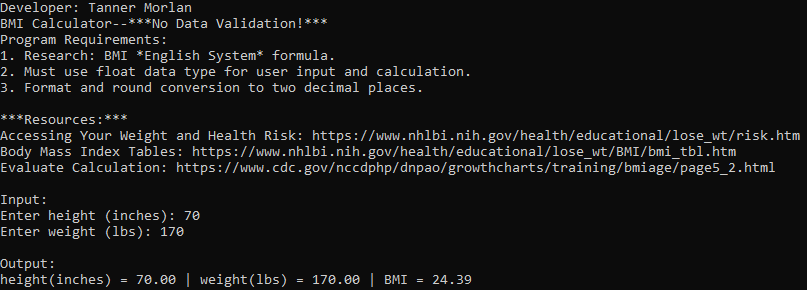
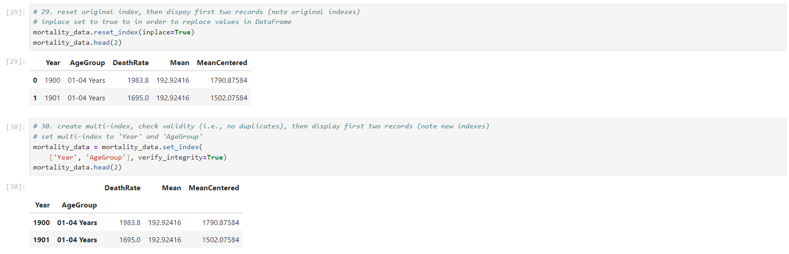
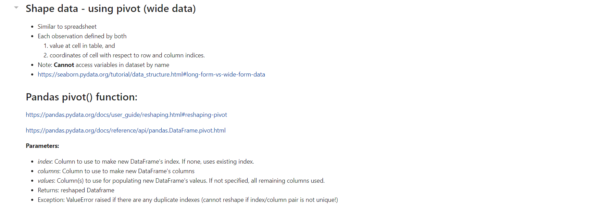
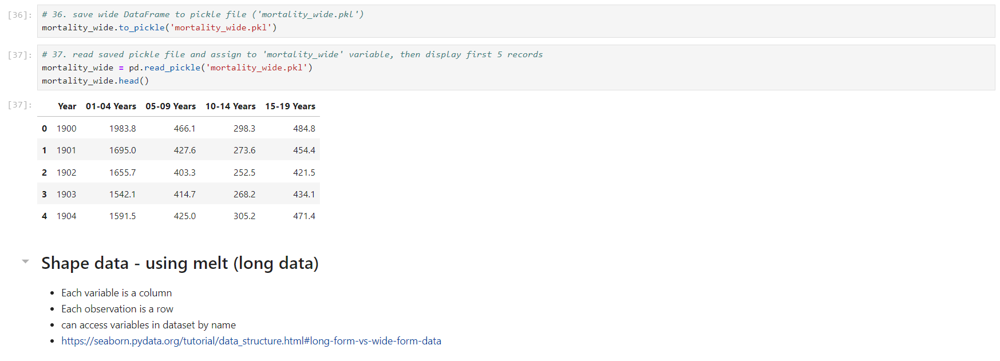
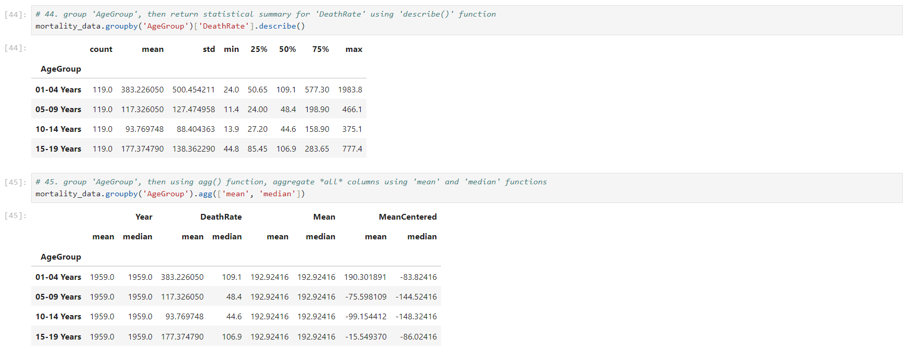

> **NOTE:** This README.md file should be placed at the **root of each of your repos directories.**
>
>Also, this file **must** use Markdown syntax, and provide project documentation as per below--otherwise, points **will** be deducted.
>

# LIS4930 - Artificial Intelligence Applications

## Tanner Morlan

### Assignment 3 Requirements:

*Five Parts:*

1. Get
2. Clean
3. Prepare
4. Analyze
5. Display/Visualize (using different types of graphs)

#### README.md file should include the following items:

* Screenshot of Jupyter Notebook
* Link to A3 .ipynb file: [a3.ipynb](a3_painting_estimator/a3.ipynb "A3 Jupyter Notebook")

> This is a blockquote.
> 
> This is the second paragraph in the blockquote.
>

#### Skillset Screenshots

*Screenshot of Skillset 4*

*Screenshot of Skillset 5*

*Screenshot of Skillset 6 With Extra Credit*

#### Assignment Screenshots:

#### Screenshot A3 Jupyter Notebook:

