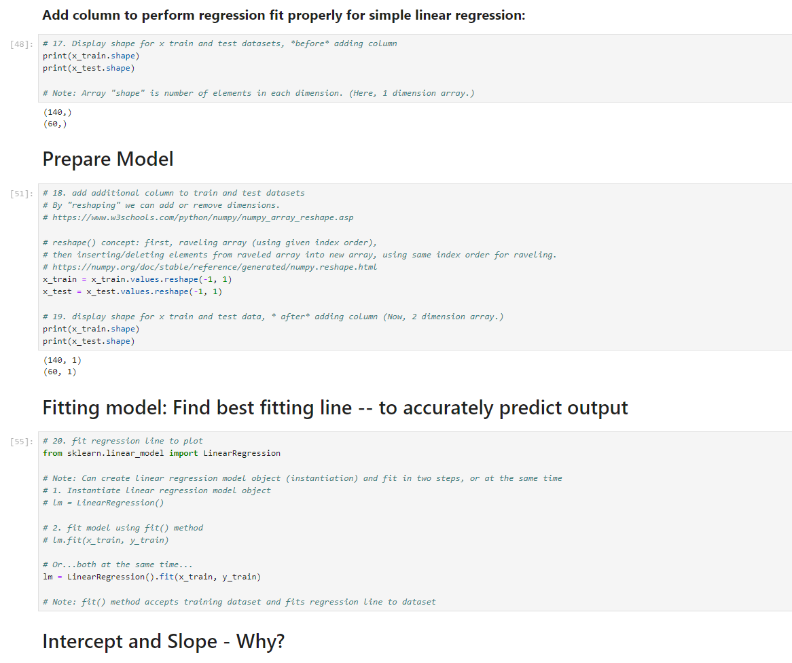

> **NOTE:** This README.md file should be placed at the **root of each of your repos directories.**
>
>Also, this file **must** use Markdown syntax, and provide project documentation as per below--otherwise, points **will** be deducted.
>

# LIS4930 - Artificial Intelligence Applications

## Tanner Morlan

### Assignment 4 Requirements:

*Nine Parts:*

1. Contrast similarities/differences among AI vs. Machine-Learning vs. Deep-Learning
2. Identify correlations
3. Use Seaborn (data visualization library build on top of matplotlib)
4. Graph correlations
5. Use simple linear regression
6. Create linear model
7. Plot regression line
8. Make predictions - using simple linear regression model
9. Plot residuals

#### README.md file should include the following items:

* Screenshot of Jupyter Notebook
* Link to A4 .ipynb file: [a4.ipynb](a4.ipynb "A4 Jupyter Notebook")

> This is a blockquote.
> 
> This is the second paragraph in the blockquote.
>

#### Skillset Screenshots

*Screenshot of Skillset 10*

*Screenshot of Skillset 10 With Extra Credit*

*Screenshot of Skillset 11*

*Screenshot of Skillset 11 With Extra Credit*

*Screenshot of Skillset 11 Extra Credit Code*

*Screenshot of Skillset 12*

#### Assignment Screenshots:

#### Screenshot P1 Jupyter Notebook:

