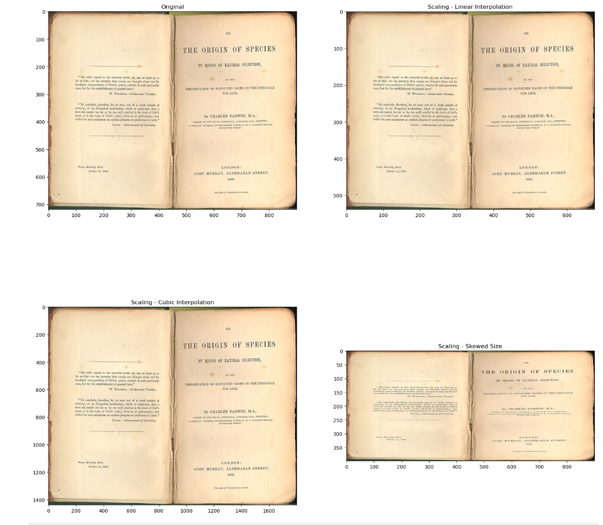

> **NOTE:** This README.md file should be placed at the **root of each of your repos directories.**
>
>Also, this file **must** use Markdown syntax, and provide project documentation as per below--otherwise, points **will** be deducted.
>

# LIS4930 - Artificial Intelligence Applications

## Tanner Morlan

### Assignment 5 Requirements:

*Nine Parts:*

1. Contrast similarities/differences among AI vs. Machine-Learning vs. Deep-Learning
2. Identify Correlations
3. Use Seaborn (data visualization library built on top of matplotlib)
4. Graph correlations
5. Use *multiple* linear regression
6. Create linear model
7. Plot regression line
8. Make predictions - using simple linear regression model
9. Plot residuals

#### README.md file should include the following items:

* Screenshot of Jupyter Notebook
* Link to A5 .ipynb file: [a5.ipynb](a5.ipynb "A5 Jupyter Notebook")

> This is a blockquote.
> 
> This is the second paragraph in the blockquote.
>

#### Skillset Screenshots

* Link to Skillset 13 my_env_versions.py file: [my_env_versions.py](../skill_sets/skillset_13_python_environments/my_env_versions.py "SS13 Code")
* Link to Skillset 13 testenv_package_list.txt file [testenv_package_list.txt](../skill_sets/skillset_13_python_environments/testenv_package_list.txt "SS13 Text File")

*Screenshot of Skillset 13*

* Link to LIS4930 package list [skillset_14_env_package_list.txt](../skill_sets/skillset_14_python_image_processing/skillset_14_env_package_list.txt)

*Screenshot of Skillset 14*

* Link to LIS4930 package list [skillset_15_env_package_list.txt](../skill_sets/skillset_15_python_image_processing_2/skillset_15_env_package_list.txt)

*Screenshot of Skillset 15*

#### Assignment Screenshots:

#### Screenshot P1 Jupyter Notebook:

