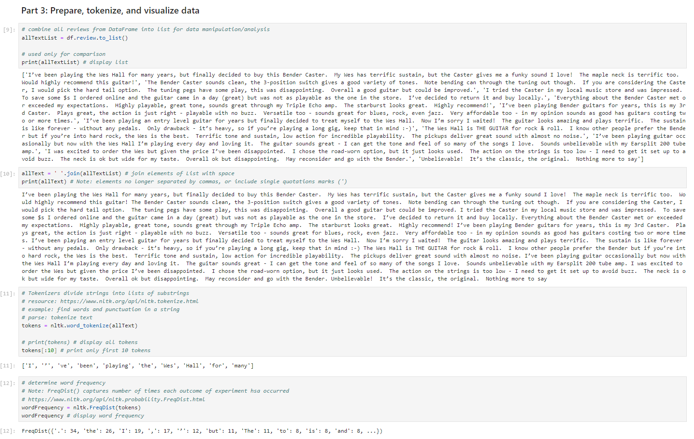
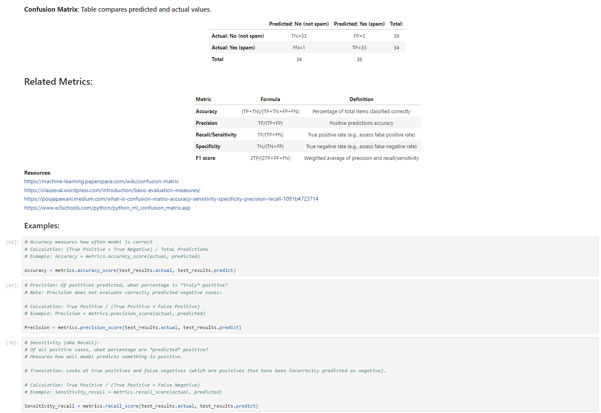

> **NOTE:** This README.md file should be placed at the **root of each of your repos directories.**
>
>Also, this file **must** use Markdown syntax, and provide project documentation as per below--otherwise, points **will** be deducted.
>

# LIS4930 - Artificial Intelligence Applications

## Tanner Morlan

### Project 1 Requirements:

*Six Parts:*
1. Import necessary packages
2. Review data
3. Prepare data for analysis
4. Filter data
5. Display product review sentiment analysis
6. Create prediction analysis

#### README.md file should include the following items:

* Screenshot of Jupyter Notebook
* Link to P1 .ipynb file: [a3.ipynb](p1/p1.ipynb "P1 Jupyter Notebook")

> This is a blockquote.
> 
> This is the second paragraph in the blockquote.
>

#### Skillset Screenshots

*Screenshot of Skillset 7*

*Screenshot of Skillset 8*

*Screenshot of Skillset 8 With Extra Credit and Result Verification*

*Screenshot of Skillset 9*

#### Assignment Screenshots:

#### Screenshot P1 Jupyter Notebook:

