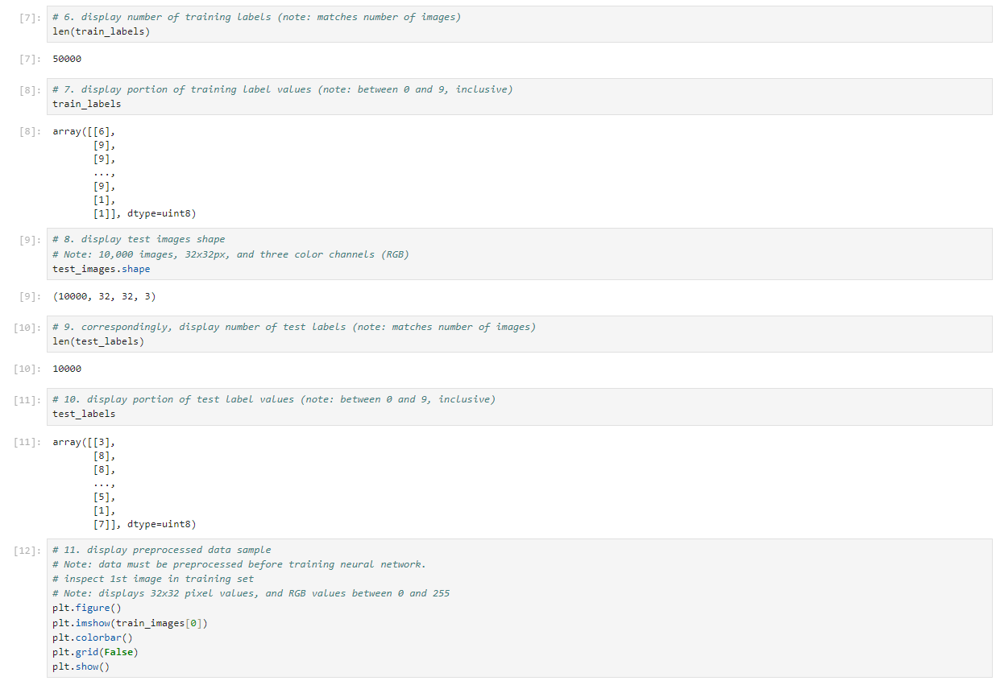

> **NOTE:** This README.md file should be placed at the **root of each of your repos directories.**
>
>Also, this file **must** use Markdown syntax, and provide project documentation as per below--otherwise, points **will** be deducted.
>

# LIS4930 - Artificial Intelligence Applications

## Tanner Morlan

### Project 2 Requirements:

*Six Parts:*

1. Describe "Deep Learning"
2. Describe "Neural networks"
3. Install necessary modules/packages
4. Import required dataset
5. Analyze images
6. Build and train convolution neural network (CNN) to classify images

#### README.md file should include the following items:

* Screenshot of Jupyter Notebook
* Link to P2 .ipynb file: [p2.ipynb](p2.ipynb "P2 Jupyter Notebook")
* Link to My GUI .ipynb file: [my_gui.ipynb](my_gui.ipynb "My GUI Jupyter Notebook")
* Link to exported LIS4930 Conda environment package list. [p2-package-list.txt](p2-package-list.txt "LIS4930 Package List")

> This is a blockquote.
> 
> This is the second paragraph in the blockquote.
>

#### Debug Demo Screenshot

*Screenshot of Debug Demo Output*

#### Assignment Screenshots:

#### Screenshot P1 Jupyter Notebook:

